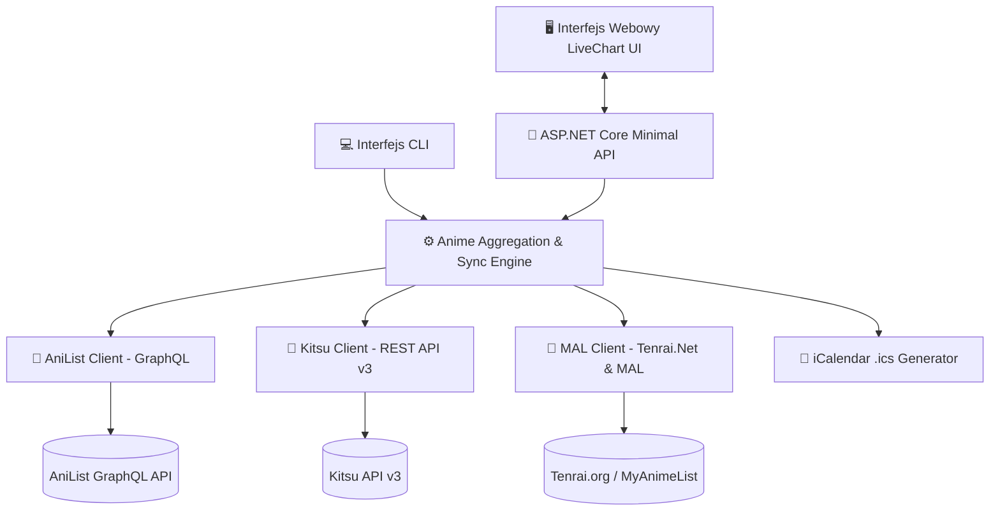

# 🌸 LiveChart Anime Tracker & Calendar

[](https://dotnet.microsoft.com/)
[](https://www.nuget.org/packages/Tenrai.Net)
[](https://graphql.anilist.co)
[](https://kitsu.app)
[](https://opensource.org/licenses/MIT)

Zaawansowane narzędzie do śledzenia ramówki, odliczania do premier nowych odcinków oraz synchronizacji list anime użytkownika inspirowane funkcjonalnością serwisu [**LiveChart.me**](https://www.livechart.me).

Aplikacja integruje dane z trzech głównych serwisów anime:
1. **AniList** – za pośrednictwem GraphQL API (ramówka na żywo, odliczanie co do sekundy, listy użytkowników).
2. **Kitsu** – za pośrednictwem oficjalnego JSON:API v3.
3. **MyAnimeList** – za pośrednictwem biblioteki [.NET **Tenrai.Net 3.1.0**](https://www.nuget.org/packages/Tenrai.Net) (oraz endpointów MAL).

---

## ✨ Główne Możliwości i Funkcje

- 📅 **Tygodniowy Kalendarz Emisji (Weekly Schedule)**:
  - Podział na dni tygodnia (Poniedziałek – Niedziela) z godzinami emisji przeliczonymi na lokalną strefę czasową użytkownika.
  - Zegar odliczający na żywo (Live Countdown) do najbliższego odcinka z numerem epizodu (np. *Odcinek 7 za 01d 04h 22m 10s*).
- 🌸 **Wykresy Sezonowe (Seasonal Charts)**:
  - Przeglądanie anime według sezonów (Zima, Wiosna, Lato, Jesień) i lat.
  - Sortowanie po popularności, ocenach i filtracja według formatu (TV, Film, OVA, ONA, Special) oraz gatunków.
- 👤 **Synchronizacja z Kontem Użytkownika (Multi-Platform Sync)**:
  - Pobieranie list: *Aktualnie oglądane (Watching)*, *Planowane (Planning)*, *Ukończone (Completed)*, *Wstrzymane (Paused)*, *Porzucone (Dropped)*.
  - Podgląd postępu oglądania (np. *5/12 odcinków*).
- 🎯 **Tryb "Tylko Mój Kalendarz" (My Schedule)**:
  - Jednym kliknięciem filtruje cały kalendarz LiveChart wyłącznie do anime, które aktualnie oglądasz lub planujesz!
- 📥 **Eksport do Kalendarza (.ics / iCalendar)**:
  - Generowanie pliku `.ics` dla Kalendarza Google, Apple Calendar i Outlooka z automatycznymi powiadomieniami przed premierą każdego odcinka.
- 🎨 **Nowoczesny Interfejs (Dark & Light Mode)**:
  - Ciemny i jasny motyw, karty anime z plakatami wysokiej rozdzielczości, modal ze szczegółowymi informacjami, studiem animacji, opisem fabuły i bezpośrednimi linkami.
- 💻 **Wbudowane CLI**:
  - Możliwość pobierania harmonogramu, sprawdzania list użytkowników i generowania `.ics` bezpośrednio z wiersza poleceń.

---

## 🏗️ Architektura Systemu



---

## 🚀 Szybki Start

### Wymagania
- Zainstalowany [.NET 8.0 SDK](https://dotnet.microsoft.com/download/dotnet/8.0)

### Uruchomienie aplikacji webowej
Najprostszym sposobem jest uruchomienie skryptu:
- **Windows (dwuklik)**: Uruchom plik `run.bat` lub `run.ps1`
- **Wiersz poleceń (CLI)**:
  ```bash
  dotnet run
  ```

Aplikacja uruchomi się pod adresem: **http://localhost:5000**

---

## 💻 Tryb Wiersza Poleceń (CLI)

Aplikacja posiada również pełne wsparcie dla wiersza poleceń:

```bash
# Wyświetlenie aktualnego tygodniowego harmonogramu emisji
dotnet run -- --schedule

# Pobranie listy oglądanych anime użytkownika z AniList
dotnet run -- --user anilist <twoj_username>

# Pobranie listy oglądanych anime użytkownika z Kitsu
dotnet run -- --user kitsu <twoj_username>

# Pobranie listy oglądanych anime użytkownika z MyAnimeList (MAL)
dotnet run -- --user myanimelist <twoj_username>

# Wyeksportowanie kalendarza .ics do pliku na dysku
dotnet run -- --export-ics anilist <twoj_username> my_schedule.ics
```

---

## 📡 Dokumentacja API REST

| Metoda | Endpoint | Opis |
| :--- | :--- | :--- |
| `GET` | `/api/schedule?platform={platform}&username={username}` | Zwraca tygodniowy harmonogram (opcjonalnie przefiltrowany dla użytkownika). |
| `GET` | `/api/seasonal?season=SUMMER&year=2026` | Zwraca anime dla wybranego sezonu i roku. |
| `GET` | `/api/user/{platform}/{username}` | Pobiera i kategoryzuje listę anime użytkownika (`anilist`, `kitsu`, `myanimelist`). |
| `GET` | `/api/export/ics?platform={p}&username={u}&onlyWatching=true&remindMinutes=15` | Generuje i pobiera plik kalendarza `.ics`. |
| `GET` | `/api/status` | Zwraca stan zdrowia serwisu i wersje bibliotek. |

---

## 📅 Import do Kalendarza Google

1. Kliknij w aplikacji przycisk **Eksportuj .ics** (lub wygeneruj plik przez CLI).
2. Otwórz [Kalendarz Google](https://calendar.google.com).
3. Kliknij ikonę koła zębatego ⚙️ **Ustawienia** w prawym górnym rogu.
4. Z menu bocznego wybierz **Importuj i eksportuj**.
5. Wskaż pobrany plik `.ics` i wybierz kalendarz, do którego mają trafić powiadomienia.

---

## 📦 Przesyłanie do GitHub

Aby przesłać kod do swojego repozytorium GitHub ([github.com/wooles](https://github.com/wooles)):

```bash
git init
git add .
git commit -m "Initial commit: LiveChart Anime Tracker (.NET 8 + Tenrai.Net + AniList + Kitsu)"
git branch -M main
git remote add origin https://github.com/wooles/livechart-anime-tracker.git
git push -u origin main
```

---

## 📄 Licencja

Projekt udostępniony na warunkach licencji [MIT](LICENSE).
